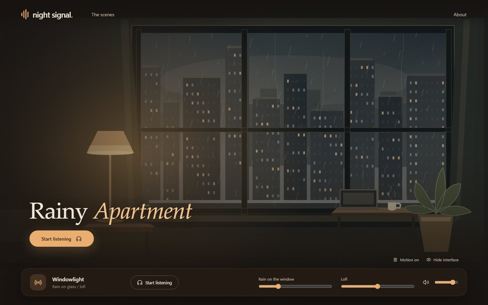
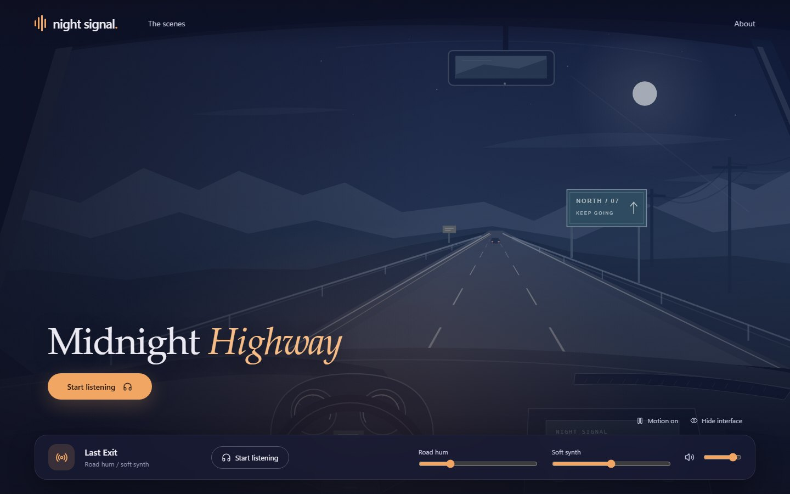
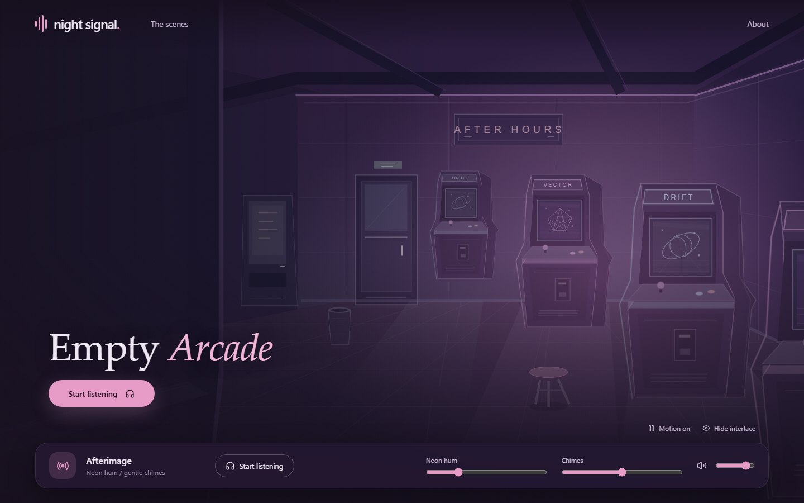
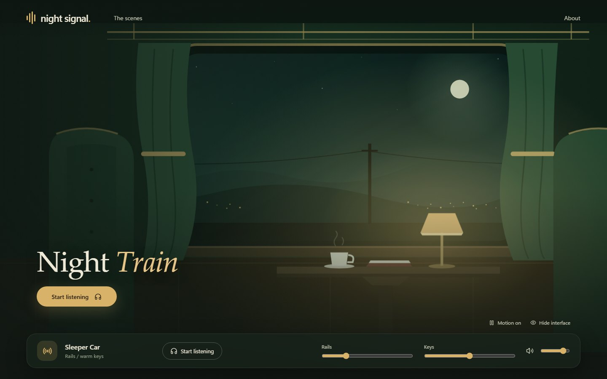
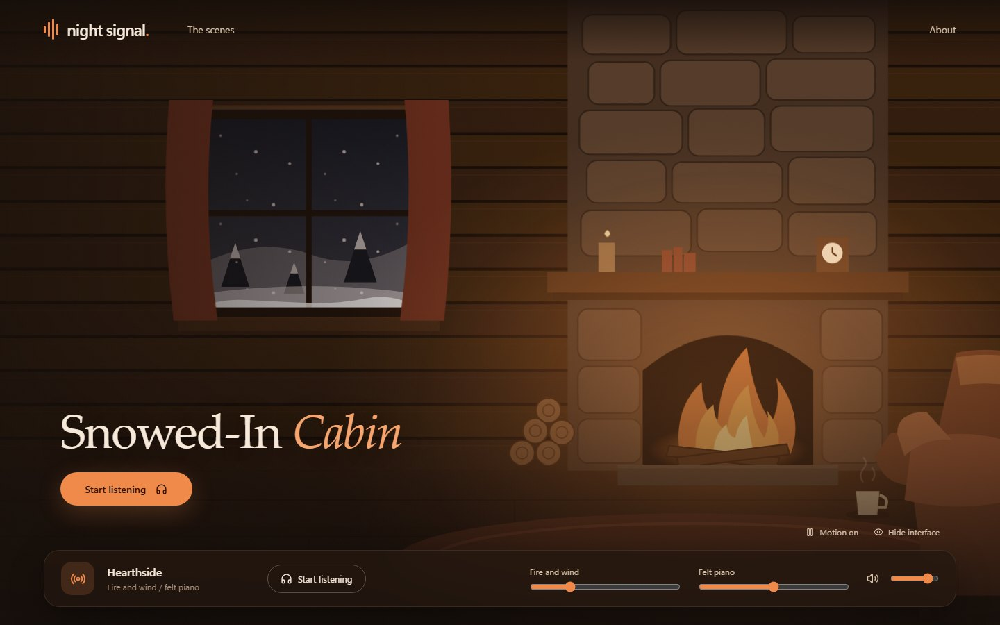
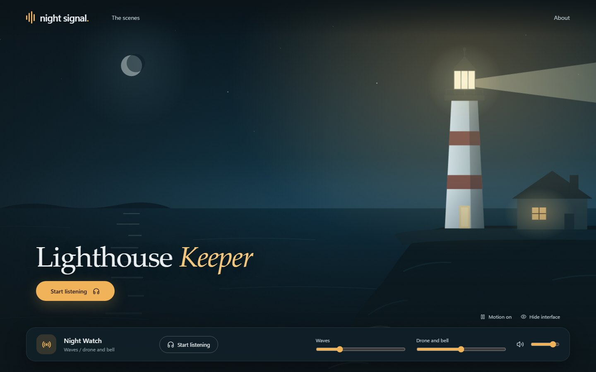
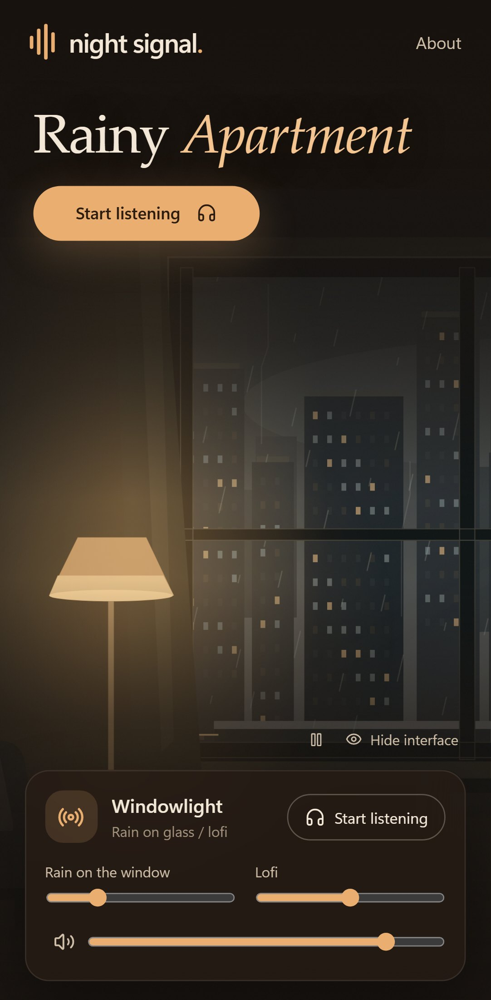

# Night Signal

A little quiet for the late hours. Pick a calming illustrated scene, press **Start listening**, and let it loop while you read, work, or drift off.

Each scene pairs an ASMR-style ambience with a music layer, and you set the balance yourself:

| Scene | Ambience | Music |
| --- | --- | --- |
| Rainy Apartment | Rain on the window | Lofi |
| Midnight Highway | Road hum | Soft synth |
| Empty Arcade | Neon hum | Chimes |
| Night Train | Rails | Keys |
| Snowed-In Cabin | Fire and wind | Felt piano |
| Lighthouse Keeper | Waves | Drone and bell |



| | | |
| --- | --- | --- |
|  |  |  |
|  |  |  |

Night Signal is a solo listening experience built as a static site with React, TypeScript, Vite, and the Web Audio API. It has no backend server, accounts, database, tracking, paid APIs, or streaming services.

Most audio is **original and procedurally synthesized** by a script in this repository. Some ambience layers are licensed Pixabay recordings; they are listed in the asset register and are not covered by the MIT license. Scene artwork is original SVG/CSS, with system fonts and Lucide interface icons. See the [asset and source register](docs/ASSETS.md) for provenance and replacement instructions.

> **Built with AI.** Night Signal was originally built with Claude Code, with
> subsequent documentation updates assisted by OpenAI Codex. The maintainer directs the work and tests the app.
> See [AI disclosure](#ai-disclosure).

## Run locally

Use Node.js **24.15 or newer within the Node 24 release line** and npm. CI pins Node 24.20.0.

```sh
npm ci
npm run dev
```

Open [127.0.0.1:3000](http://127.0.0.1:3000). No audio is downloaded or played until you press **Start listening**. Once listening has started, choosing another scene loads its layers and crossfades into them. **Pause** and **Resume** control playback; if a download fails, **Retry audio** tries again.

Each scene has separate ambience and music sliders. Layer levels, overall volume, and mute are remembered in your browser's local storage. A scene can be linked directly, for example `/#highway`.

Use **Hide interface** for an unobstructed scene, then **Show interface** or Escape to restore the controls. Scene motion can be paused independently of audio, pauses while the tab is hidden, and respects the device's reduced-motion preference. The **About** dialog includes credits for licensed recordings.

## Build and host

```sh
npm run build
```

The `dist/` folder is the whole site, including the audio files. Serve its contents at the root of a domain or subdomain on a static host. `wrangler.jsonc` configures Cloudflare Workers static assets: connect the repository in Cloudflare (build command `npm run build`, deploy command `npx wrangler deploy`) and each push to `main` publishes `dist/`. Any other static host works too.

The current build uses root-relative asset URLs such as `/audio/apartment-rain.wav` and `/favicon.svg`. Hosting under a subdirectory such as `/night-signal/` requires changes to Vite's base path and the root-relative URLs in the app; uploading the current build there is insufficient. Scene links use URL fragments such as `/#highway`.

`npm run preview` serves the built site at [127.0.0.1:4173](http://127.0.0.1:4173) for a final local check.

## Layout

- `src/scenes.ts` is the catalog: each scene's text and its audio layers.
- `src/useSoundscape.ts` loads a scene's layers, loops them, and crossfades between scenes.
- `src/mix.ts` holds the level math and saved preferences.
- `src/Scene.tsx`, `src/OtherScenes.tsx`, and one `src/*Art.tsx` file per newer scene draw the scenes; `src/App.tsx` is the interface.
- `public/audio/` contains all looping layers. `scripts/generate-audio.mjs` reproduces the nine synthetic layers; the three processed licensed recordings are committed separately and are never overwritten by the generator.
- `scripts/screenshots.mjs` regenerates the README images in `docs/screenshots/`: run `npm run build`, start `npm run preview`, then `npm run screenshots` in another terminal. Retake them when the interface or artwork changes.
- `docs/ASSETS.md` records audio and artwork provenance, recording modifications, and license notices.
- `tests/` contains mixer and audio-catalog unit tests; `tests/e2e/` contains desktop and mobile browser checks.

To add a scene, extend `SceneId` and `SCENES` in `src/scenes.ts`, wire its artwork into `src/Scene.tsx`, and add its palette, layout, and restrained motion in `src/styles.css`. Add synthetic layers to the generator or prepare permitted recordings with catalog credits, and document all assets in `docs/ASSETS.md`. Keep the shared player independent of scene artwork. Run the checks below and inspect desktop and mobile layouts, including reduced motion.

## Checks and tests

```sh
npm run check
npx playwright install chromium
npm run test:e2e
```

`check` runs TypeScript checking, ESLint, unit tests, and the production build. The unit tests also inspect every audio file for format, headroom, and a click-free loop seam. The browser suite uses Playwright at desktop and phone sizes against the production build. CI runs both commands for every pull request and each push to `main`; browser failure artifacts are retained for seven days.

To regenerate the nine synthetic audio layers:

```sh
npm run audio:generate
```

The generator uses fixed random seeds for reproducible output. Commit the generated WAVs whenever the generator changes. It does not recreate or modify the Rainy Apartment rain, Midnight Highway road, or Night Train rails recordings; their sources and processing steps are documented under [Licensed recordings](docs/ASSETS.md#licensed-recordings).

## Contributing

Follow [AGENTS.md](AGENTS.md): file a labeled issue before starting work, use one working branch and PR per issue, and label the PR. CI must pass before merging into `main`; delete the working branch after merge. Releases and tags require explicit maintainer permission.

## AI disclosure

Night Signal was originally built with [Claude Code](https://claude.com/claude-code),
Anthropic's AI coding assistant, which wrote the initial code, tests, and documentation.
Subsequent documentation updates have also been assisted by OpenAI Codex.
The maintainer ([@TheRealestNwah](https://github.com/TheRealestNwah)) directs the
project, tests the app, and makes release decisions. The commit history records
contributions, including `Co-Authored-By` trailers for AI-assisted changes.

## Support

Everything on my GitHub is free of charge and open source. If you find it
useful and want to leave a tip or buy me a coffee, you can do that at
[ko-fi.com/morrowheat23](https://ko-fi.com/morrowheat23). It's appreciated,
never expected.

## License

MIT — see [LICENSE](LICENSE). Licensed third-party recordings in `public/audio/` keep their own licenses; see [docs/ASSETS.md](docs/ASSETS.md#licensed-recordings).
